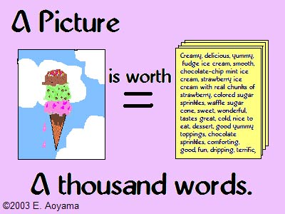

# Drawing diagrams crashcourse

## Motto

> A picture is worth a thousand words

is an English language-idiom. It refers to the notion that a complex idea can be conveyed with just a single picture much more effectively than a description does.

## Why to draw?

 * see motto for details
 * sometimes it is more easy than a description
 * language neutral form

## What to draw?

 * 

## Who is the audience?

 * 

## Picking the picture type

 * 
 
## Other drawing guidelines

 * Take your time, don't hurry
 * Use colors
 * Keep the simplest geometrical grid
   * square / rectagular
   * circular
 * Don't repeat every detail more than once / twice
 * Always first draw on paper before making an electronic one

# References
 * http://esheninger.blogspot.com/2018/08/a-picture-is-worth-thousand-words.html
 * http://oels.byu.edu/student/idioms/proverbs/a_pic_thousand_words.html
